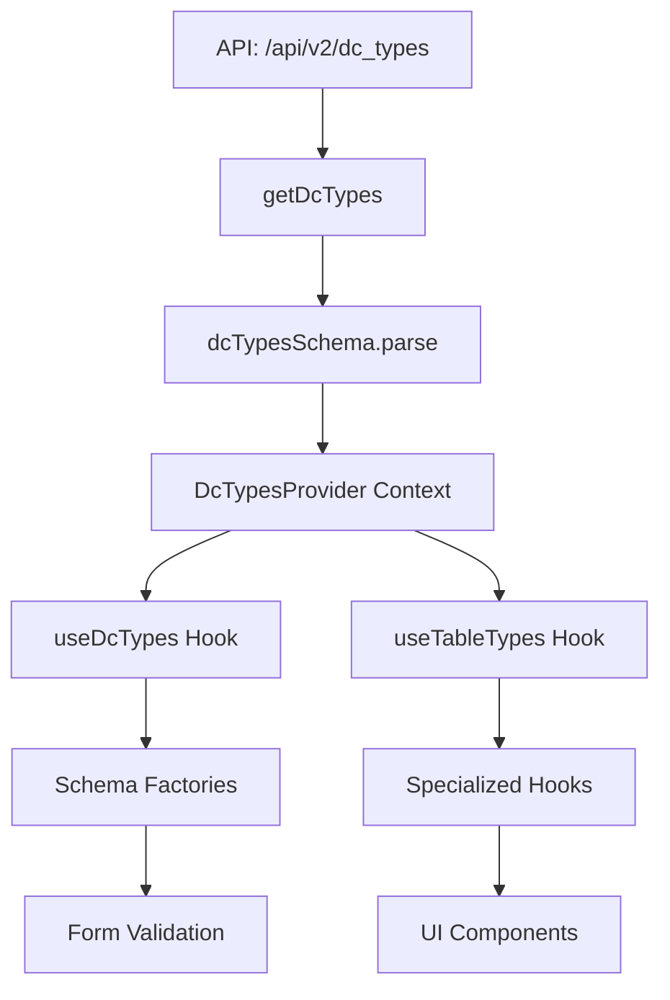

# DCTypes System Documentation

A comprehensive reference data management system that provides standardized lookup tables, validation schemas, and business logic constants across the DataCanvas application.

## 📋 Overview

The DCTypes system serves as the central source of truth for all reference data in the application. It manages lookup tables for business entities like theaters, pricing models, booking types, service types, and other domain-specific data that drives form validation, dropdown options, and business rules.

### Key Responsibilities

- **Reference Data Management**: Centralized storage and access to lookup tables
- **Dynamic Validation**: Schema generation based on available options
- **Business Logic Constants**: Provides configuration data for business rules
- **Type Safety**: Ensures compile-time and runtime type validation
- **Caching & Performance**: Optimized data loading with React Query integration

## 🏗️ Architecture Overview

### System Components

```
hooks/dcTypes/
├── useDcTypes.tsx     # Context provider and base hook
├── useTableTypes.ts   # Generic table access and specialized hooks
├── index.ts          # Public API exports
└── README.md         # This documentation

domain/DcTypes/
├── schema.ts         # Core schemas and validation logic
├── SalesLevel.ts     # Sales hierarchy specific types
└── index.ts          # Schema exports
```

### Data Flow Architecture



## 🔧 Core Schema Architecture

### Base Data Structure

```typescript
// Core mapping structure for all lookup data
export const dcTypeMapSchema = z.object({
  id: z.number(),           // Unique identifier
  value: z.string(),        // Display value/label
  is_deleted: z.boolean(),  // Soft delete flag
  extra: z.record(z.any()).nullish(), // Additional metadata
});

// Table structure grouping related mappings
export const dcTableSchema = z.object({
  table_name: z.string(),                    // Table identifier
  mappings: z.array(dcTypeMapSchema),        // Array of options
});

// Complete DCTypes structure
export const dcTypesSchema = z.array(dcTableSchema);
```

### Extended Schemas

**Booking Type Extra Data**:
```typescript
export const dcTypeBookingTypeExtraSchema = z.object({
  is_prospective: z.boolean(),  // Prospective booking flag
  is_budgeted: z.boolean(),     // Budget allocation flag
});
```

**Anchor Date Iterator Extra Data**:
```typescript
export const dcTypeAnchorDateIteratorExtraSchema = z.object({
  is_direct: z.boolean(),  // Direct iteration flag
});
```

## 🎯 Dynamic Schema Factory

### Schema Generation Pattern

The system includes a sophisticated factory for creating dynamic validation schemas:

```typescript
export const mappedOptionSchema = (name: string, options: TOption[]) => {
  const optionNames = options.map((option) => option.value);
  const optionMembers = new Set(
    options.map((option) => option.value.toLowerCase())
  );

  return z.string({
    required_error: `${name} is required`,
    invalid_type_error: `${name} must be text`,
  })
  .transform((val) => val.trim())
  .superRefine((val, ctx) => {
    if (!optionMembers.has(val.toLowerCase())) {
      ctx.addIssue({
        code: z.ZodIssueCode.custom,
        message: `${val} is not a valid ${name}. Allowed values: ${optionNames.join(", ")}`,
      });
    }
  })
  .transform((val) => {
    return options.find(
      (option) => option.value.toLowerCase() === val.toLowerCase()
    )!.id;
  });
};
```

### Factory Benefits

- **Dynamic Validation**: Validates against current available options
- **Case Insensitive**: Handles user input flexibility
- **Rich Error Messages**: Provides helpful validation feedback
- **ID Resolution**: Transforms display values to database IDs
- **Type Safety**: Maintains TypeScript type inference

## 🔄 Data Access Layer

### API Integration

**Endpoint**: `GET /api/v2/dc_types`

```typescript
export const getDcTypes = async (): Promise<TDcTypes> => {
  const response = await client.get(`${V2_URL}/dc_types`);
  return parseDcTypes(response.data);
};
```

### React Query Integration

```typescript
export const getDcTypesQuery = {
  queryKey: dcTypesQueryKeys.lists(),
  queryFn: getDcTypes,
};
```

**Caching Strategy**:
- **Stale Time**: 12 hours (reference data changes infrequently)
- **Retry Logic**: Exponential backoff (2s, 4s, 8s, 16s, up to 60s)
- **App Blocking**: Application waits for DCTypes before rendering
- **Window Focus**: Disabled refetch on window focus

## 🎣 Hook System

### Base Hook: useDcTypes

Provides raw access to all DCTypes data:

```typescript
const useDcTypes = (): TDcTypes => {
  const context = useContext(DcTypesContext);
  if (!context) {
    throw new Error("useDcTypes must be used within a DcTypesProvider");
  }
  return context.dcTypes;
};
```

**Context Provider Setup**:
```typescript
const DcTypesProvider: FC<PropsWithChildren> = ({ children }) => {
  const { data: dcTypes, isLoading } = useQuery({
    queryKey: getDcTypesQuery.queryKey,
    queryFn: getDcTypesQuery.queryFn,
    refetchOnMount: false,
    refetchOnWindowFocus: false,
    staleTime: 12 * 60 * 60 * 1000, // 12 hour stale time
    retry: true,
    retryDelay: (attempt) => Math.min(1000 * 2 ** attempt, 60000),
  });

  if (isLoading || !dcTypes) {
    return <LoadingSpinnerFullPage />;
  }

  return (
    <DcTypesContext.Provider value={{ dcTypes }}>
      {children}
    </DcTypesContext.Provider>
  );
};
```

### Generic Hook: useTableTypes

Provides filtered access to specific tables:

```typescript
export const useTableTypes = <T extends TDcTableNames[]>(
  props: TUseTableTypeProps<T>
): Readonly<TUseTableTypesReturn<T>> => {
  const { table_names } = props;
  const dcTypes = useDcTypes();

  return table_names.reduce((acc, table_name) => {
    const table = dcTypes.find((dcType) => dcType.table_name === table_name);
    return {
      ...acc,
      [table_name]: {
        all: table.mappings,
        available: table.mappings.filter(
          (mapping) => !mapping.is_deleted
        ) as AvailableTables,
      },
    };
  }, {} as TUseTableTypesReturn<T>);
};
```

### Specialized Hooks

The system provides 20+ specialized hooks for common use cases:

```typescript
// Theater management
export const useTheaterTableTypes = () => {
  const { dc_theater } = useTableTypes({ table_names: ["dc_theater"] });
  return dc_theater;
};

// Booking user roles with specific role extraction
export const useBookingsUserRolesTableTypes = () => {
  const { dc_bookings_user_role } = useTableTypes({
    table_names: ["dc_bookings_user_role"],
  });

  const camPrimary = fetchDistinctAvailableValue(
    dc_bookings_user_role.available,
    "cam-primary"
  );
  // ... other specific role extractions

  return {
    ...dc_bookings_user_role,
    camPrimary,
    camSecondary,
    camBackup,
    // ... other role mappings
  };
};

// Service type management with allocation constants
export const useSoldAsServiceTableTypes = () => {
  const { dc_sold_as_service_types } = useTableTypes({
    table_names: ["dc_sold_as_service_types"],
  });

  const serviceTypeUnknown = fetchDistinctAvailableValue(
    dc_sold_as_service_types.available,
    "Unknown"
  );

  const serviceTypePremium = fetchDistinctAvailableValue(
    dc_sold_as_service_types.available,
    "Premium"
  );

  const serviceTypeStandardSW = fetchDistinctAvailableValue(
    dc_sold_as_service_types.available,
    "Standard(SW)"
  );

  const serviceTypeStandardHW = fetchDistinctAvailableValue(
    dc_sold_as_service_types.available,
    "Standard(HW)"
  );

  return {
    ...dc_sold_as_service_types,
    serviceTypeUnknown,
    serviceTypePremium,
    serviceTypeStandardSW,
    serviceTypeStandardHW,
  };
};

// Sales level management
export const useSalesLevelTableTypes = () => {
  const { dc_sales_level } = useTableTypes({
    table_names: ["dc_sales_level"],
  });
  return dc_sales_level;
};
```

## 📊 Available Table Types

### Standard Business Tables

| Table Name | Purpose | Common Usage |
|------------|---------|--------------|
| `dc_theater` | Geographic regions/theaters | Booking location selection |
| `dc_pricing_model` | Pricing methodology types | Contract pricing configuration |
| `dc_buying_programs` | Purchase program categories | Procurement classification |
| `dc_sold_as_service_types` | Service delivery models | Service type configuration |
| `dc_contract_types` | Contract classifications | Contract categorization |
| `dc_engagement_sfc_types` | SFC engagement types | Engagement classification |
| `dc_engagement_stakeholder_types` | Stakeholder roles | Role management |

### Operational Tables

| Table Name | Purpose | Common Usage |
|------------|---------|--------------|
| `dc_bookings_user_role` | User role assignments | Permission management |
| `dc_typ_disengage` | Disengagement reasons | Contract termination |
| `dc_typ_signoff_method` | Sign-off methodologies | Approval workflows |
| `dc_typ_signoff_event` | Sign-off event types | Workflow triggers |
| `dc_typ_defer_signoff_reason` | Deferral justifications | Workflow exceptions |
| `dc_typ_root_causes` | Issue root cause analysis | Problem categorization |

### Process-Specific Tables

| Table Name | Purpose | Common Usage |
|------------|---------|--------------|
| `dc_typ_booking_type` | Booking classifications | Booking categorization |
| `dc_sdp_typ_anchor_date` | SDP date anchoring | Delivery planning |
| `dc_sdp_typ_anchor_date_iterator` | Date iteration patterns | Schedule management |
| `dc_sdp_typ_task_completion_reason` | Task closure reasons | Task management |
| `dc_sales_level` | Sales hierarchy levels | Sales territory management |

## 🎨 Integration Patterns

### Form Integration Example

```typescript
// Using DCTypes for form validation
export const useDcLookup = () => {
  const {
    dc_buying_programs,
    dc_pricing_model,
    dc_theater,
    dc_sold_as_service_types,
  } = useTableTypes({
    table_names: [
      "dc_buying_programs",
      "dc_pricing_model", 
      "dc_theater",
      "dc_sold_as_service_types",
    ],
  });

  // Create lookup maps for O(1) access
  const theater_lookup = new Map(
    dc_theater.available.map((theater) => [theater.id, theater.value])
  );

  return {
    theater_lookup,
    theater_options: dc_theater.available, // For dropdowns
  };
};
```

### Dropdown Component Integration

```typescript
// Using DCTypes in UI components
const MyFormComponent = () => {
  const { theater_options, theater_lookup } = useDcLookup();
  
  return (
    <Select>
      {theater_options.map((option) => (
        <MenuItem key={option.id} value={option.id}>
          {option.value}
        </MenuItem>
      ))}
    </Select>
  );
};
```

### Schema Factory Usage

```typescript
// Creating dynamic validation schemas
const CreateBookingSchema = (dcTypes: TDcTypes) => {
  const theaterTable = dcTypes.find(t => t.table_name === "dc_theater");
  const theaterOptions = theaterTable?.mappings.filter(m => !m.is_deleted);
  
  return z.object({
    theater_id: mappedOptionSchema("Theater", theaterOptions),
    // ... other fields
  });
};
```

## 🚀 Performance Optimization

### Caching Strategy

- **Application Load**: DCTypes loaded once at app startup
- **Context Memoization**: Prevents unnecessary re-renders
- **Selective Loading**: useTableTypes filters only needed tables
- **Lookup Maps**: O(1) access patterns for frequent lookups

### Memory Management

- **Filtered Views**: `available` vs `all` reduces processed data
- **Lazy Evaluation**: Hooks only process requested tables
- **Map Caching**: Lookup maps cached at component level

## 🧪 Testing Considerations

### Unit Testing Focus Areas

- Schema validation with various input types
- Dynamic schema factory edge cases
- Hook return type consistency
- Context provider error boundaries
- Cache invalidation scenarios

### Integration Testing

- API response parsing
- Context provider integration
- Form validation workflows
- Component dropdown population
- Error state handling

## 🔧 Maintenance & Extension

### Adding New Table Types

1. **Update Type Union**:
```typescript
type TDcTableNames = 
  | "existing_table"
  | "new_table_name";  // Add here
```

2. **Create Specialized Hook**:
```typescript
export const useNewTableTypes = () => {
  const { new_table_name } = useTableTypes({
    table_names: ["new_table_name"],
  });
  return new_table_name;
};
```

3. **Add to Integration Layer**:
```typescript
// Update useDcLookup if commonly used
export const useDcLookup = () => {
  const { new_table_name } = useTableTypes({
    table_names: ["new_table_name"], // Add here
  });
  // ... create lookup maps
};
```

### Schema Extension Patterns

For tables requiring extra metadata:

```typescript
export const dcTypeNewExtraSchema = z.object({
  custom_field: z.boolean(),
  metadata: z.string().optional(),
});
```

### Performance Monitoring

Watch for:
- Context re-render frequency
- Large table filtering performance
- Network request patterns
- Memory usage growth

## 🔗 Dependencies

### Core Dependencies
- `zod`: Schema validation and type inference
- `@tanstack/react-query`: Data fetching and caching
- `react`: Context API and hooks

### Integration Points
- **API Layer**: `~/api/dcTypes.ts`
- **Query Layer**: `~/queries/dcTypes.ts`
- **Hook Layer**: `~/hooks/dcTypes/`
- **Feature Integration**: Manager Portal, Workflows, Forms

## 💡 Best Practices

### Hook Usage
- Use specialized hooks over generic `useDcTypes` when possible
- Create lookup maps for frequent ID-to-value translations
- Cache expensive computations with `useMemo`

### Schema Creation
- Use `mappedOptionSchema` for user input validation
- Include helpful error messages for validation failures
- Consider case-insensitive matching for user experience

### Performance
- Filter to `available` items unless soft-deleted items needed
- Use table-specific hooks to minimize data processing
- Implement proper error boundaries for context consumers

### Error Handling
- Always use hooks within DcTypesProvider context
- Handle loading states appropriately in UI
- Implement fallbacks for missing table data

---

*The DCTypes system provides the foundation for consistent, validated, and performant reference data management across the DataCanvas application. Understanding its architecture is crucial for implementing robust forms, validation, and business logic.*